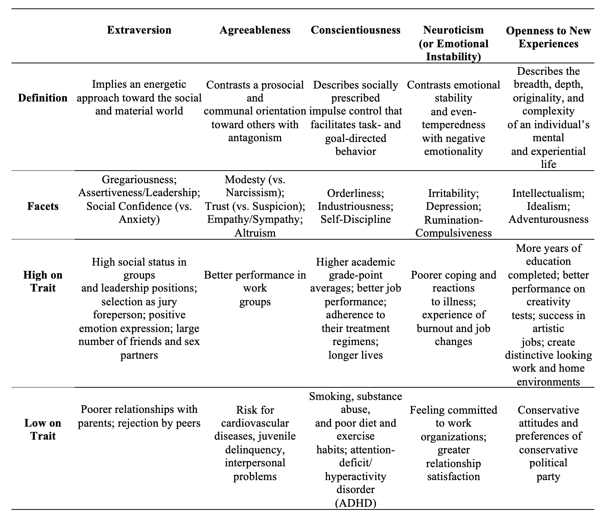

---

<!-- Global site tag (gtag.js) - Google Analytics -->

<i>Big Five Personality Traits</i> theory is one of the most recent and widely accepted approaches in political psychology scholarship to enclose the links between personality traits and political beliefs. <i>Big Five Personality Traits</i> research employs lexical analysis by asking individuals about a certain set of personality adjectives’ fitness to their personality attributes, and later, applies exploratory and confirmatory factor analyses to those questions to identify broader personality traits domains (Gosling, Rentfrow, & Swann Jr, 2003; Gerber, Huber, Doherty and Dowling, 2011). 

Accordingly, <i>Big Five Personality Traits</i> theory puts forward the following five personality traits: (i) <i>Extraversion</i>, (ii) <i>Agreeableness</i>, (iii) <i>Conscientiousness</i>, (iv) <i>Neuroticism</i> (or <i>Emotional Instability</i>) and (v) <i>Openness to New experiences</i>. In our current study, we want to ascertain the extent of Openmindedness-related differences in several political attitudes and behaviors (for a brief illustration of each trait’s dimensions, please see Figure 1). 

{ width=75% }

---
   
<b><i>Note:</i></b> Figure 1's content was adapted from John, Naumann, & Soto (2008); Ha, Kim, & Jo (2013, s. 514); and Weinschenk (2017). 

 
<u>Sources cited in this page:</u>
 
[1] Gerber, A. S., Huber, G. A., Doherty, D., Dowling, C. M., & Ha, S. E. (2010). Personality and political attitudes: relationships across issue domains and political contexts. <i>American Political Science Review</i>, <i>104</i>(1), 111-133. https://doi.org/10.1017/S0003055410000031

[2] Gosling, S. D., Rentfrow, P. J., & Swann Jr, W. B. (2003). A very brief measure of the big-five personality domains. <i>Journal of Research in Personality</i>, <i>37</i>, 504-528. https://doi.org/10.1016/S0092-6566(03)00046-1 

[3] Ha, S. E., Kim, S., & Jo, S. H. (2013). Personality traits and political participation: Evidence from South Korea. <i>Political Psychology</i>, <i>34</i>(4), 511-532. https://doi.org/10.1111/pops.12008

[4] John, O. P., Naumann, L. P. and Soto, C. J. (2008). Paradigm shift to the integrative big five trait taxonomy: History, measurement and conceptual issues. In: O. P. John, R. W. Robins and L. A. Pervin (eds.) Handbook of Personality: Theory and Research (3rd Ed.). New York: Guilford, pp. 114-158.

[5] Weinschenk, A. C. (2017). Big five personality traits, political participation, and civic engagement: Evidence from 24 countries. <i>Social Science Quarterly</i>, <i>98</i>(5), 1406-1421. https://doi.org/10.1111/ssqu.12380
